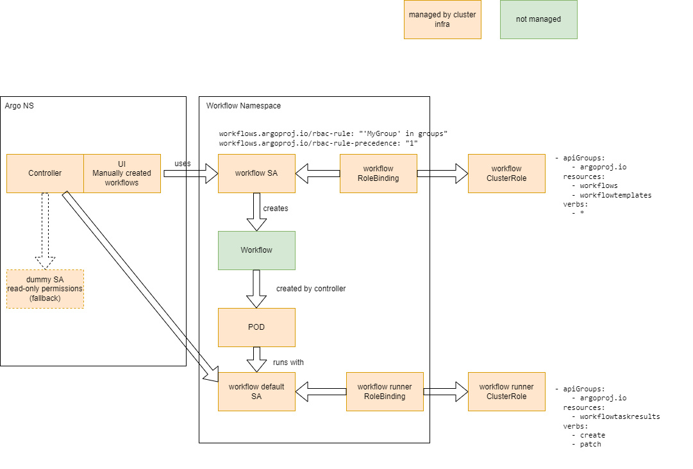

# Incubator cluster setup

_Description about how, why etc. we made the setup of Argo-Workflows, -Events, -Rollout in our incubator-cluster._

## Deployment

* 1x cluster scoped Argo Worflows controller
  * Start workflows through User Interface
    * Use "SSO RBAC Namespace Delegation" method, in short ...
      * Worflows created through UI will use dedicated ServiceAccount in target namespace (workflow SA)
      * Workflow ServiceAccount references OIDC groups as annotations to map permissions
      * OIDC group not referenced, fallback to default ServiceAccount (read-only permissions)
    * Reference: <https://argoproj.github.io/argo-workflows/argo-server-sso/#sso-rbac-namespace-delegation>
  * CICD deployed workflows
    * ArgoCD ServiceAccount can deploy workflows in target namespaces
  * Pod created by controller runs as default ServiceAccount in target namespace
    * Default ServiceAccount in target namespace gets permissions to get/list Workflowtaskresults

## Logs

* Controller and Workflow logs written to stdout and therefore written to log aggregator
  * retention defined by tenant
