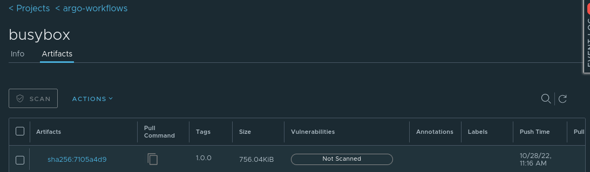

# Build images on k8s with Kaniko and Argo

## Intro

> Do not use this setup in production

* Create GitHub webhook which triggers Argo Events
* Argo Events
  * github event-source listens to GitHub webhook
  * sensor creates image-build workflow
* Argo Workflows
  * create image build workflow
    * run image build with [Kaniko](https://github.com/GoogleContainerTools/kaniko)
  * use a generic ClusterWorkflowTemplates


### Argo workflows part

Image Builds will run in flux02 namespace.

Create flux02 namespace

```bash
kubectl create ns flux02
```

> Image Build will runAsUser 0. Creation of [security context constraints](https://docs.openshift.com/container-platform/4.11/authentication/managing-security-context-constraints.html) on OpenShift necessary

```bash
kubectl create -f examples/workflows-scc-kaniko.yml
```

Create Kubernetes secret `credentials` in `flux02` namespace with key `.dockerconfigjson` containing credentials to push to private registry containing `username`, `password` and `registry`.

[How to create .dockerconfigjons secret](https://kubernetes.io/docs/tasks/configure-pod-container/pull-image-private-registry/#registry-secret-existing-credentials)

Example:

```yaml
apiVersion: v1
kind: Secret
metadata:
  name: credentials
  namespace: flux02
data:
  .dockerconfigjson: XXXXXX
type: kubernetes.io/dockerconfigjson
```

Create Kaniko ServiceAccount

```bash
kubectl -n flux02 create -f examples/workflows-sa-kaniko.yml
```

Assign RBAC to ServiceAccount
Reference: <https://argoproj.github.io/argo-workflows/workflow-rbac/>

```bash
kubectl -n flux02 create -f examples/workflows-role-kaniko.yml
kubectl -n flux02 create -f examples/workflows-rolebinding-kaniko.yml
```

Create ClusterWorkFlowTemplate, which...

* ... references default .dockerconfigjson
* ... Specifies to runAs uid 0
* ... defines containerTemplate

```bash
less examples/workflows-clusterworkflowtemplate-image-build.yml
kubectl create -f examples/workflows-clusterworkflowtemplate-image-build.yml
```

Manually create a workflow to test the image-build, which ...

* ... defines the ServiceAccount
* ... provides repo url for application root
* ... provides the link to the dockerfile
* ... provides the target container registry, image and tag

```bash
less examples/workflows-busybox.yml
kubectl -n flux02 create -f examples/workflows-busybox.yml
```

References:

* <https://argoproj.github.io/argo-workflows/>
* <https://github.com/alexmt/argo-combined-demo>
* <https://github.com/vfarcic/argo-workflows-demo/blob/master/workflows/cd-mock.yaml>

#### Argo Events part

Let's start the image-build, as soon as someone pushes changes to the repository containing the application data and DockerFile.

Create GitHub webhook which triggers Argo Events
<https://docs.github.com/en/developers/webhooks-and-events/webhooks/about-webhooks>

Deploy [eventbus](https://argoproj.github.io/argo-events/concepts/eventbus/)

```bash
kubectl -n flux02 create -f examples/events-eventbus.yml
```

Create RBAC to allow Argo Events the creation of Workflows

```bash
kubectl -n flux02 create -f examples/events-sensor-rbac.yaml
```

Deploy Argo [eventsource](https://argoproj.github.io/argo-events/concepts/event_source/), which ...

* ... references your repo, [events](https://docs.github.com/en/developers/webhooks-and-events/events/github-event-types) and a secret which needs to be defined on K8s and in your GitHub Webhook configuration
* ... exposes the webhook as a route (might need to change it to ingress and adapt hostname)

```bash
kubectl -n flux02 create -f examples/events-eventsource.yml
kubectl -n flux02 create -f examples/events-route-event-github.yml
```

Create Argo [Sensor](https://argoproj.github.io/argo-events/concepts/sensor/), which ...

* ... references above created eventsource
* ... create the image build workflow in the same namespace

```bash
kubectl -n flux02 create -f examples/events-sensor-webhook.yml
```

Push to Github and check creation of Workflow

```bash
argo -n flux02 get @latest
```

```bash
Name:                busybox-nzv5b
Namespace:           flux02
ServiceAccount:      kaniko
Status:              Succeeded
Conditions:
 PodRunning          False
 Completed           True
Created:             Fri Oct 28 11:16:25 +0200 (34 seconds ago)
Started:             Fri Oct 28 11:16:25 +0200 (34 seconds ago)
Finished:            Fri Oct 28 11:16:45 +0200 (14 seconds ago)
Duration:            20 seconds
Progress:            1/1
ResourcesDuration:   9s*(1 cpu),9s*(100Mi memory)

STEP              TEMPLATE                          PODNAME                                                    DURATION  MESSAGE
 ✔ busybox-nzv5b  build
 └─✔ build        container-image/build-kaniko-git  busybox-nzv5b-container-image/build-kaniko-git-2872416784  8s
```

Get logs and check image in registry

```bash
argo -n flux02 logs @latest
```

```log
busybox-nzv5b-build-kaniko-git-1487577275: Enumerating objects: 218, done.
Counting objects: 100% (218/218), done. objects:  64% (140/218)0% (1/218)
Compressing objects: 100% (175/175), done. objects:  33% (58/175) 0% (1/175)
busybox-nzv5b-build-kaniko-git-1487577275: Total 218 (delta 91), reused 83 (delta 29), pack-reused 0
busybox-nzv5b-build-kaniko-git-1487577275: INFO[0000] Retrieving image manifest busybox
busybox-nzv5b-build-kaniko-git-1487577275: INFO[0000] Retrieving image busybox from registry index.docker.io
busybox-nzv5b-build-kaniko-git-1487577275: INFO[0002] Built cross stage deps: map[]
busybox-nzv5b-build-kaniko-git-1487577275: INFO[0002] Retrieving image manifest busybox
busybox-nzv5b-build-kaniko-git-1487577275: INFO[0002] Returning cached image manifest
busybox-nzv5b-build-kaniko-git-1487577275: INFO[0002] Executing 0 build triggers
busybox-nzv5b-build-kaniko-git-1487577275: INFO[0002] Building stage 'busybox' [idx: '0', base-idx: '-1']
busybox-nzv5b-build-kaniko-git-1487577275: INFO[0002] Unpacking rootfs as cmd RUN echo "test" requires it.
busybox-nzv5b-build-kaniko-git-1487577275: INFO[0002] Taking snapshot of full filesystem...
busybox-nzv5b-build-kaniko-git-1487577275: INFO[0002] Initializing snapshotter ...
busybox-nzv5b-build-kaniko-git-1487577275: INFO[0002] RUN echo "test"
busybox-nzv5b-build-kaniko-git-1487577275: INFO[0002] Cmd: /bin/sh
busybox-nzv5b-build-kaniko-git-1487577275: INFO[0002] Args: [-c echo "test"]
busybox-nzv5b-build-kaniko-git-1487577275: INFO[0002] Running: [/bin/sh -c echo "test"]
busybox-nzv5b-build-kaniko-git-1487577275: test
busybox-nzv5b-build-kaniko-git-1487577275: INFO[0002] Taking snapshot of full filesystem...
busybox-nzv5b-build-kaniko-git-1487577275: INFO[0002] No files were changed, appending empty layer to config. No layer added to image.
busybox-nzv5b-build-kaniko-git-1487577275: INFO[0002] Pushing image to registry.baloise.dev/argo-workflows/busybox:1.0.0
busybox-nzv5b-build-kaniko-git-1487577275: INFO[0003] Pushed registry.baloise.dev/argo-workflows/busybox@sha256:7105a4d94e8ba06f8b737dda4e9d59de1865af0580650b3171e556c2ac0b5ec5
busybox-nzv5b-build-kaniko-git-1487577275: time="2022-10-28T09:16:33.078Z" level=info msg="sub-process exited" argo=true error="<nil>"
```

Verify image in registry



References:

* <https://argoproj.github.io/argo-events/sensors/triggers/argo-workflow/>
