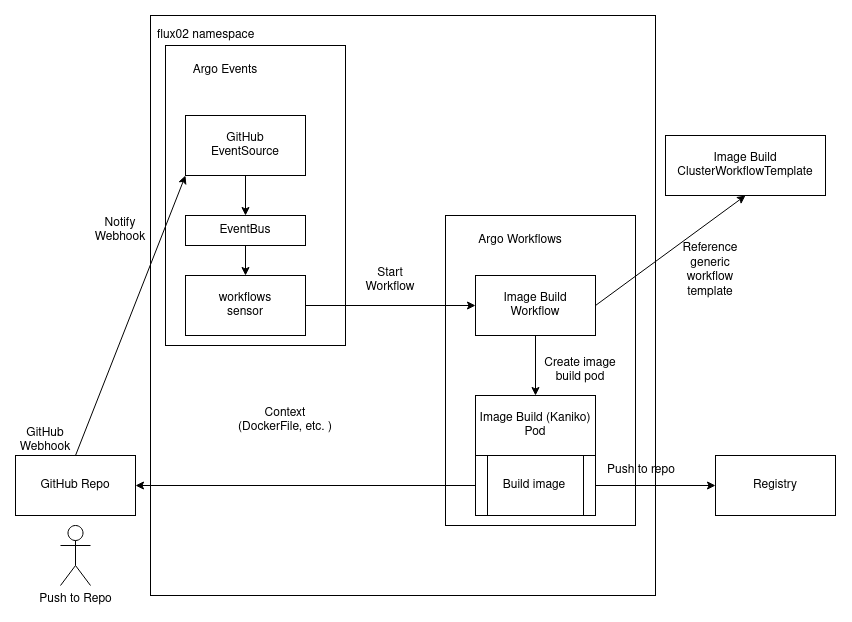

# Build images on k8s with Kaniko and Argo

## Intro

> Do not use this setup in production

* Create GitHub webhook which triggers Argo Events
* Argo Events
  * github event-source listens to GitHub webhook
  * sensor creates image-build workflow
* Argo Workflows
  * create image build workflow
    * run image build with [Kaniko](https://github.com/GoogleContainerTools/kaniko)
  * use a generic ClusterWorkflowTemplates



### Argo workflows part

Image Builds will run in flux02 namespace.

Create flux02 namespace

```bash
kubectl create ns flux02
```

> Image Build will runAsUser 0. Creation of SCC on OpenShift necessary

```bash
kubectl create -f examples/workflows-scc-kaniko.yml
```

Create Kubernetes secret `credentials` in `flux02` namespace with key `.dockerconfigjson` containing credentials to push to private registry containing `username`, `password` and `registry`.

[How to create .dockerconfigjons secret](https://kubernetes.io/docs/tasks/configure-pod-container/pull-image-private-registry/#registry-secret-existing-credentials)

Example:

```yaml
apiVersion: v1
kind: Secret
metadata:
  name: credentials
  namespace: flux02
data:
  .dockerconfigjson: XXXXXX
type: kubernetes.io/dockerconfigjson
```

Create Kaniko ServiceAccount

```bash
kubectl -n flux02 create -f examples/workflows-sa-kaniko.yml
```

Assign RBAC to ServiceAccount
Reference: <https://argoproj.github.io/argo-workflows/workflow-rbac/>

```bash
kubectl -n flux02 create -f examples/workflows-role-kaniko.yml
kubectl -n flux02 create -f examples/workflows-rolebinding-kaniko.yml
```

Create ClusterWorkFlowTemplate, which...

* ... references default .dockerconfigjson
* ... Specifies to runAs uid 0
* ... defines containerTemplate

```bash
less examples/workflows-clusterworkflowtemplate-image-build.yml
kubectl create -f examples/workflows-clusterworkflowtemplate-image-build.yml
```

Manually create a workflow to test the image-build, which ...

* ... defines the ServiceAccount
* ... provides repo url for application root
* ... provides the link to the dockerfile
* ... provides the target container registry, image and tag

```bash
less examples/workflows-busybox.yml
kubectl -n flux02 create -f examples/workflows-busybox.yml
```

References:

* <https://argoproj.github.io/argo-workflows/>
* <https://github.com/alexmt/argo-combined-demo>
* <https://github.com/vfarcic/argo-workflows-demo/blob/master/workflows/cd-mock.yaml>

#### Argo Events part

Let's start the image-build, as soon as someone pushes changes to the repository containing the application data and DockerFile.

Create GitHub webhook which triggers Argo Events
<https://docs.github.com/en/developers/webhooks-and-events/webhooks/about-webhooks>

Deploy [eventbus](https://argoproj.github.io/argo-events/concepts/eventbus/)

```bash
kubectl -n flux02 create -f examples/events-eventbus.yml
```

Create RBAC to allow Argo Events the creation of Workflows

```bash
kubectl -n flux02 create -f examples/events-sensor-rbac.yaml
```

Deploy Argo [eventsource](https://argoproj.github.io/argo-events/concepts/event_source/), which ...

* ... references your repo, [events](https://docs.github.com/en/developers/webhooks-and-events/events/github-event-types) and a secret which needs to be defined on K8s and in your GitHub Webhook configuration
* ... exposes the webhook as a route (might need to change it to ingress and adapt hostname)

```bash
kubectl -n flux02 create -f examples/events-eventsource.yml
kubectl -n flux02 create -f examples/events-route-event-github.yml
```

Create Argo [Sensor](https://argoproj.github.io/argo-events/concepts/sensor/), which ...

* ... references above created eventsource
* ... create the image build workflow in the same namespace

```bash
kubectl -n flux02 create -f examples/events-sensor-webhook.yml
```

References:

* <https://argoproj.github.io/argo-events/sensors/triggers/argo-workflow/>
